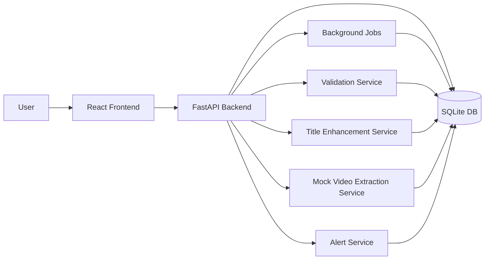

# SellerSight.AI

Product Intelligence Dashboard for e-commerce sellers.

SellerSight.AI helps a Flipkart seller upload product data (video first, CSV fallback), validate listing quality, compare competitor prices, and generate actionable alerts.

## 1. Assignment Coverage

Implemented end-to-end:

- Product video upload with mocked extraction pipeline
- Product CSV fallback upload with background jobs
- Job status tracking (PENDING, RUNNING, COMPLETED, FAILED, PARTIALLY_COMPLETED)
- Listing validation with severity-based issues and quality score
- Optional title enhancement flow
- Competitor price CSV ingestion and simulated refresh
- Price comparison analytics and recommendation
- Alert generation and in-app alert management
- Dashboard metrics and visualizations
- Product list and product detail workflows

## 2. Tech Stack

Backend

- Python 3.11+
- FastAPI
- SQLAlchemy ORM
- SQLite (default; configurable via DATABASE_URL)

Frontend

- React 18 + TypeScript
- Vite
- Tailwind CSS
- React Query
- Axios
- Recharts

## 3. Repository Structure

- backend: FastAPI app, routers, services, models, schemas
- frontend: React app
- sample_data: reviewer-ready CSV files
- render.yaml: Render deployment manifest
- vercel.json: Vercel deployment config for frontend

## 4. Architecture



## 5. Key Features

### 5.1 Upload and Job Processing

- POST /upload-video starts async video processing job
- POST /upload-products-csv starts async CSV processing job
- GET /jobs and GET /jobs/{job_id} for progress tracking

### 5.2 Listing Validation

Rules include:

- Missing title
- Very short title
- Missing brand
- Invalid price
- MRP lower than selling price
- Missing image
- Broken image URL
- Duplicate SKU
- Weak description
- Missing important attributes
- Out of stock

Output:

- Product issues with HIGH, MEDIUM, LOW severity
- Product quality score

### 5.3 Title Enhancement

- Boolean enhance_title toggle during upload
- POST /products/{sku_id}/enhance-title for on-demand enhancement
- Stores:
  - enhanced_title
  - extracted attributes
  - suggested keywords
  - enhancement reason

### 5.4 Competitor Pricing

- POST /competitor-prices/upload for competitor CSV
- POST /competitor-prices/refresh for simulated market refresh job
- GET /products/{sku_id}/competitor-prices for comparison summary

### 5.5 Alerts

- Auto-generated listing and pricing alerts
- GET /alerts with filters
- POST /alerts/mark-read for bulk mark-as-read

## 6. API Reference

### System

- GET /health
- GET /

### Upload

- POST /upload-video
- POST /upload-products-csv

### Jobs

- GET /jobs
- GET /jobs/{job_id}

### Products

- GET /products
- GET /products/{sku_id}
- PATCH /products/{sku_id}
- GET /products/{sku_id}/issues
- POST /products/{sku_id}/enhance-title

### Dashboard

- GET /dashboard/quality-summary

### Competitor Prices

- POST /competitor-prices/upload
- POST /competitor-prices/refresh
- GET /products/{sku_id}/competitor-prices
- GET /competitor-prices/{sku_id}

### Alerts

- GET /alerts
- POST /alerts/mark-read

OpenAPI docs:

- /docs
- /redoc

## 7. Local Setup

### 7.1 Backend

From repository root:

```powershell
cd backend
py -m venv venv
.\venv\Scripts\Activate.ps1
pip install -r requirements.txt
copy .env.example .env
uvicorn main:app --reload
```

Backend URL:

- http://localhost:8000

### 7.2 Frontend

From repository root:

```powershell
cd frontend
npm install
copy .env.example .env
npm run dev
```

Frontend URL:

- http://localhost:5173

## 8. Sample Files for Testing

- sample_data/sample_products.csv
- sample_data/sample_competitor_prices.csv

Recommended review sequence:

1. Upload video from Upload page
2. Upload sample product CSV fallback
3. Upload sample competitor CSV
4. Open Dashboard, Products, Product Detail, Alerts, Jobs pages
5. Trigger Refresh Competitor Prices and observe jobs + new alerts

## 9. Deployment

### Option A: Render (Backend + Frontend)

- Manifest file: render.yaml
- Backend service root: backend
- Frontend static service root: frontend

### Option B: Vercel (Frontend) + Render/Railway (Backend)

- Frontend config: vercel.json
- Set VITE_API_URL to your deployed backend URL

### Option C: Docker Compose (Local)

From repository root:

```powershell
docker compose up --build
```

Services:

- Frontend: http://localhost:4173
- Backend API: http://localhost:8000
- API docs: http://localhost:8000/docs

Stop services:

```powershell
docker compose down
```

## 10. Deployment Links

Update these after deployment:

- Frontend URL: https://sellersightai.vercel.app
- Backend API URL: https://sellersight-api.onrender.com
- GitHub Repository: https://github.com/LVSJanakiRamaraju/SellerSight.AI

## 11. What Is Real vs Mocked

Real:

- Full UI and API flows
- DB persistence
- Validation and alert logic
- Async job tracking
- Competitor comparison calculations

Mocked/Simulated:

- Video extraction pipeline (mocked deterministic extraction)
- OCR/frame analysis internals (simulated)
- Competitor live scraping (not used; CSV + simulated refresh used)

## 12. Assumptions and Trade-offs

Assumptions:

- Mock integrations are acceptable as per assignment guidance
- Flipkart is the own selling platform reference
- Competitor data ingestion can be CSV/manual/simulated

Trade-offs:

- No external auth for MVP
- SQLite for simplicity
- No external notification channels (email/slack) in MVP

## 13. Known Limitations

- Video extraction is mocked, not ML OCR-based
- No historical trend charts in frontend yet
- No retry queue UI for failed jobs yet
- No role-based access/auth

## 14. Improvements with More Time

- Real OCR + multimodal extraction
- Scheduled refresh daemon and retries
- Notification integrations (Slack/Email/WhatsApp)
- Price history charts per platform
- Exportable PDF/CSV quality reports
- Auth and multi-tenant seller support

## 15. Submission Notes Template

Use this block for final assignment submission:

- Frontend deployment link: https://sellersightai.vercel.app
- Backend API link: https://sellersight-api.onrender.com
- GitHub repository link: https://github.com/LVSJanakiRamaraju/SellerSight.AI
- README: this file
- Test credentials/instructions: no auth required
- Sample files: sample_data/sample_products.csv and sample_data/sample_competitor_prices.csv
- Fully implemented: end-to-end upload, validation, dashboard, comparison, alerts, jobs, frontend workflows
- Mocked: video extraction internals and competitor live feeds
- Next improvements: real OCR/AI extraction, scheduled refresh, external notifications
